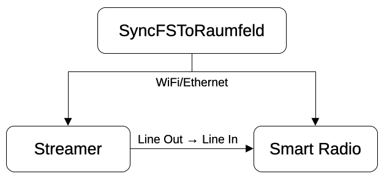

SyncFSToRaumfeld
================
SyncFSToRaumfeld is a Python program for integrating a Frontier Silicon smart radio (e.g., Teufel Musicstation or Radio 3sixty) into the Teufel Raumfeld multiroom system. You need a Teufel Streamer connected to the AUX input port of the smart radio and a dedicated computer such as a Raspberry Pi running SyncFSToRaumfeld. SyncFSToRaumfeld automatically switches the smart radio to the AUX input when the Teufel Streamer starts playback, and switches back to the previous smart radio input and power state when playback stops.

Supported functions:
--------------------
* automatically switches smart radio on/off
* automatically selects the correct input on the smart radio
* the volume of the smart radio is set to a pre-defined level when the Teufel Streamer is active, allowing predictable volume levels with the Raumfeld system

Requirements:
-------------
**Hardware**
* Teufel Streamer (a Teufel/Raumfeld Connector may also work)
* Frontier Silicon-based smart radio (tested with Teufel Musicstation, but Teufel Radio 3sixty, or compatible smart radios from Roberts Radio, Technisat, Hama, Medion, etc. may also work)
* a computer running the SyncFSToRaumfeld script (a low-cost computer such as a Raspberry Pi is recommended)

**Audio connection**
* connect the Teufel Streamer Line Out to the Line In (AUX In) of the smart radio

**Network**
* make sure the Teufel Streamer and the Frontier Silicon smart radio are on the same network

**Python**
* tested with Python 3.11

**Python libraries**
* pysimplesoap (tested with 1.16.2)
* lxml (tested with 4.9.2)
* PyRaumfeld
* FSAPI

_pysimpelsoap_ and _lxml_ can be installed via _pip_ from online sources, _PyRaumfeld_ and _FSAPI_ must be installed from the provided folders:
1. install setuptools  
    * `pip install setuptools`
2. install PyRaumfeld  
    * change into the PyRaumfeld directory  
    * `pip install .`
3. install FSAPI  
    * change into the python-fsapi directory  
    * `pip install .`

Installation of SyncFSToRaumfeld
================================
SyncFSToRaumfeld can run on any system supporting Python (e.g. Linux, macOS, Windows). For a Raspberry Pi running Raspberry Pi OS do the following:

* copy _SyncFSToRaumfeld.py_ into the home directory of a user (e.g. /home/pi/bin)
* ensure that _SyncFSToRaumfeld.py_ is owned and executeable by this user
  * `chown pi:pi SyncFSToRaumfeld.py`
  * `chmod u+x SyncFSToRaumfeld.py`

Configuration
=============
Set the following variables in the _SyncFSToRaumfeld.py_ script:

* set the IP Adress of the smart radio (`RADIO_HOST_IP`)
* set the Raumfeld room name of the Teufel Streamer (`STREAMER_ROOM_NAME`)  
  Note: The room name is case sensitive. You can find the room name in the Teufel Raumfeld phone app in the mini player (check the bottom of the app's home screen).
* The preset values of `RADIO_PIN`, `RADIO_MODE` and `RADIO_VOLUME` are suitable for the Teufel Musicstation but may need to be adjusted for other radio models.

First Start:
------------
To ensure that SyncFSToRaumfeld can connect to all devices, change the `LOG_LEVEL` in the script to `logging.INFO` and start it with `python SyncFSToRaumfeld.py`. Make sure that SyncFSToRaumfeld finds the smart radio and the Teufel Streamer, and controls the smart radio mode when you start/stop playback on the Teufel Streamer.

Automatic Start:
----------------
You can use _systemd_ to start SyncFSToRaumfeld at boot time and restart it automatically if it crashes.
Create a systemd service file _/etc/systemd/system/SyncFSToRaumfeld.service_ with the following content:

`[Unit]`  
`Description=Synchronize a Frontier Silicon Radio with a Teufel Streamer`  
`After=multi-user.target`  
`Requires=network.target`  

`[Service]`  
`Type=exec`  
`ExecStart=/home/pi/bin/SyncFSToRaumfeld.py`  
`Restart=on-failure`  
`RestartSec=10`  
`User=pi`  
`Group=pi`  

`[Install]`  
`WantedBy=multi-user.target`

The path of the executable (`ExecStart`) and the user/group (`User`/`Group`) need to be adapted to your system.

Limitations
===========
* the IP adress of the Frontier Silicon smart radio must be fixed: either set a fixed IP address on the radio or assign a fixed IP address via DHCP
* Teufel Streamer devices are identified by their room name, multiple Teufel Streamer devices per room are not supported

Debugging
=========
* set the log level to `logging.INFO`
* if you are using systemd:
  * check the status of the service: `systemctl status SyncFSToRaumfeld`
  * check the systemd journal: `journalctl -u SyncFSToRaumfeld -e`

Changelog
=========

* v1.0: initial release

License
=======
SyncFSToRaumfeld is licensed under the MIT license.

Contact
=======
Patrick Ofner <patrick@ofner.science>
